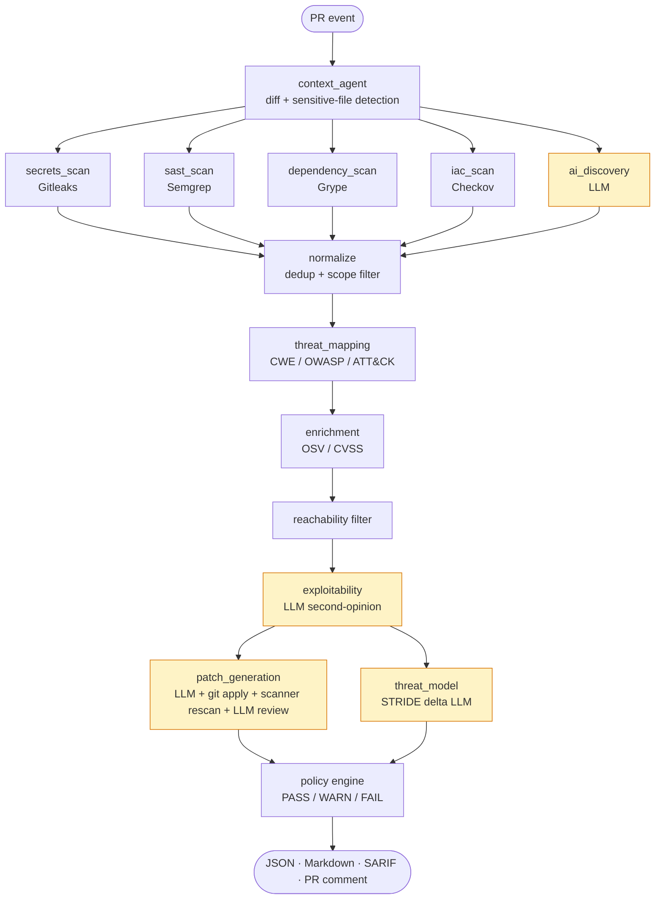

# SecureFlow AI

An agentic DevSecOps reviewer that runs on every pull request. It combines deterministic security scanners with LLM-driven reasoning to produce a structured review comment, a SARIF report, and a CI gate decision (`PASS` / `WARN` / `FAIL`).

The deterministic side handles what scanners are good at: secret detection, SAST patterns, dependency CVEs, and IaC misconfigurations. The LLM side handles what scanners miss: business-logic flaws, authorization gaps, design-level threats (STRIDE), exploitability reasoning, and patch generation. The final policy decision is always made by deterministic Python; LLM output is advisory.

---

## Status

- 5 parallel scanners (Gitleaks, Semgrep, Grype, Checkov, AI Vulnerability Discovery)
- 4 LLM reasoning agents (AI Discovery, Exploitability, STRIDE Threat-Model Delta, Patch Generation + Review)
- 4-link provider failover chain (DeepSeek, Gemini, Groq, OpenRouter) with JSON-repair fallback and tolerant schemas
- 3 policy profiles (`advisory` / `balanced` / `strict`) and dependency triage (`direct_runtime` / `direct_dev` / `transitive`) for calibrated CI gating
- 233 unit tests, ruff-clean
- Validated on 40 labeled fixtures across 2 pipeline modes (80 orchestrator runs total) on a standard Ubuntu CI runner with zero degraded stages

### Self-review evidence

The dependency-triage feature was reviewed by SecureFlow AI itself before merge. Pointing the live bot at the PR that introduced the new `manifest_parser` tool, the STRIDE Threat-Modeling Delta agent flagged a real path-traversal weakness *the human reviewer had missed*:

> **Manifest parser reads arbitrary files from repo path** — `secureflow/tools/manifest_parser.py:63` · severity medium · confidence 0.70
>
> The `parse_manifests` function reads files from the repository based on user-provided manifest paths. If an attacker can control the `manifest_paths` list (e.g., via a crafted PR), they could cause the parser to read arbitrary files outside the intended manifests, potentially leaking sensitive information.
>
> **Required mitigations before merge:**
> - Validate that resolved paths are within the repository directory (e.g., using `os.path.commonpath` or `Path.relative_to`).
> - Restrict `manifest_paths` to only files that were actually changed in the PR.

The original code resolved every path naively:

```python
full = (repo / rel).resolve()
if not full.exists() or not full.is_file():
    continue
sub = _dispatch(full)
```

The shipped fix applies exactly the mitigation the bot suggested — `Path.relative_to(repo)`:

```python
repo = Path(repo_path).resolve()
for rel in manifest_paths:
    full = (repo / rel).resolve()
    try:
        full.relative_to(repo)
    except ValueError:
        # Resolved path escapes the repository root — skip.
        continue
    # ... + 2 MiB per-manifest size cap as DoS guard
```

Two unit tests (`test_parse_rejects_path_traversal`, `test_parse_skips_oversized_manifest`) lock the fix in. The bot also flagged a missing file-size cap (DoS) — same patch addressed it. End-to-end this is the strongest evidence that the agentic-review approach catches design-level weaknesses that scanner-only tools miss: the threat-model agent isn't a marketing slide, it's reviewing this repo's own code.

---

## Architecture



LLM-using nodes are shaded. Every LLM call goes through:

- A cross-provider failover chain so rate-limits, schema-validation failures, and quota exhaustion route to the next provider automatically.
- A content-addressed cache keyed on `(prompt_version, model, temperature, hashed input)` so re-pushes do not re-bill.
- A per-PR token budget with graceful degradation when exhausted.
- A Pydantic-validated structured-output contract.
- A `json_repair` fallback that recovers almost-valid model output (missing key quotes, unterminated strings near `max_tokens`, missing commas) without burning an extra LLM call.

Patches additionally get a dedicated chain (DeepSeek first), a gibberish sanity check that rejects mojibake before applying, and a second-opinion LLM review that confirms the patch addresses the specific vulnerability and matches the surrounding code style.

See [`ARCHITECTURE.md`](ARCHITECTURE.md) and [`design/`](design/) for the full component catalog and per-subsystem specs.

---

## Installation

### Prerequisites

- Python 3.11
- `gitleaks` and `grype` binaries on `$PATH`
- `semgrep` and `checkov` Python packages (installed via pip below)

### From source

```bash
git clone https://github.com/<your-account>/secureflow-ai.git
cd secureflow-ai
python -m venv .venv
source .venv/bin/activate    # PowerShell: .\.venv\Scripts\Activate.ps1
pip install -e . semgrep checkov
```

Install the scanner binaries:

```bash
# Linux / macOS
curl -sSfL https://raw.githubusercontent.com/anchore/grype/main/install.sh \
  | sudo sh -s -- -b /usr/local/bin

GITLEAKS_VERSION=8.30.1
curl -sSL "https://github.com/gitleaks/gitleaks/releases/download/v${GITLEAKS_VERSION}/gitleaks_${GITLEAKS_VERSION}_linux_x64.tar.gz" \
  | tar xz -C /tmp gitleaks
sudo install -m 0755 /tmp/gitleaks /usr/local/bin/gitleaks
```

On Windows: download the prebuilt binaries from each tool's releases page and place them on `PATH`.

### API keys

Copy `.env.example` to `.env` and fill in at least one provider:

```env
GROQ_API_KEY=                  # free tier: https://console.groq.com/keys
GEMINI_API_KEY=                # free tier: https://aistudio.google.com/apikey
DEEPSEEK_API_KEY=              # paid prepaid: https://platform.deepseek.com/
OPENROUTER_AI_API_KEY=         # free tier: https://openrouter.ai/settings/keys
```

The pipeline degrades gracefully when keys are missing: agents that require an LLM emit a single skip-banner on the PR comment, and the deterministic policy decision still applies.

---

## Quickstart

### Local CLI

```bash
# Scan the current directory
secureflow scan --repo . --output report.json --markdown report.md --sarif report.sarif

# Fast iteration without LLM calls
secureflow scan --repo . --no-llm
```

The CLI writes JSON, Markdown, and SARIF artifacts. Exit codes: `0` for `PASS` or `WARN`, `1` for `FAIL`, `2` for terminal errors.

### Run the evaluation harness

```bash
# Deterministic baseline (no LLM cost)
secureflow eval run --no-llm --output reports/eval_scanners_only.md

# Full pipeline
secureflow eval run --output reports/eval_full.md \
    --llm-concurrency 1 --max-findings-to-exploit 15 --max-patches 5
```

---

## GitHub Actions integration

A drop-in workflow ships at [`.github/workflows/secureflow.yml`](.github/workflows/secureflow.yml). Copy it into your repository's `.github/workflows/` directory and:

1. Add at least one provider API key as a repository secret. `GROQ_API_KEY` is the simplest free option; `DEEPSEEK_API_KEY` is recommended for patch generation.
2. Optionally add `GEMINI_API_KEY` and `OPENROUTER_AI_API_KEY` for chain failover.
3. Open a pull request.

The workflow:

- Caches `.secureflow_cache/` keyed on the head SHA so re-pushes reuse LLM responses.
- Uses a concurrency group that cancels stale runs on rapid re-pushes.
- Posts a structured PR comment under the marker `<!-- secureflow-ai:bot-comment -->` and edits the same comment on subsequent pushes rather than creating new ones.
- Uploads SARIF to the repository's Security tab when Code Scanning is enabled (free on public repos; requires GitHub Advanced Security on private repos).
- Exits with code 1 on a `FAIL` decision so the PR's CI status reflects the outcome.

A separate workflow [`.github/workflows/eval.yml`](.github/workflows/eval.yml) runs the evaluation harness on PRs that touch fixtures or pipeline code and uploads the full report as an artifact.

### Least-privilege permissions

The shipped workflow requests only:

```yaml
permissions:
  contents: read
  pull-requests: write
  security-events: write
```

`security-events: write` is needed only when SARIF upload is enabled. The workflow does not need write access to repository contents.

---

## Configuration

Everything lives in `.secureflow.yml` at the repository root. Every section is optional with sensible defaults.

```yaml
llm:
  # Cross-provider chain, strongest first.
  provider: deepseek
  model: deepseek-chat
  fallback_providers: [gemini, groq, openrouter]

  # Patch generation has its own chain because patches require higher
  # JSON-output reliability than the other schemas.
  patch_provider: deepseek
  patch_fallback_providers: [gemini, groq]

  temperature: 0.1
  max_tokens: 4096
  cache: true

scanners:
  semgrep:   { enabled: true, config: auto }
  gitleaks:  { enabled: true }
  grype:     { enabled: true }
  checkov:   { enabled: true }   # IaC / Dockerfile / Kubernetes / GH Actions

ai_discovery:
  enabled: true
  trigger_on_sensitive_files: true

policy:
  # advisory | balanced | strict — see "Policy profiles" below.
  profile: balanced
  fail_on:
    - critical_secret
    - critical_cve
    - high_confidence_injection
    - confirmed_auth_bypass
  warn_on:
    - medium_ai_discovery
    - low_confidence_high_impact
    - outdated_dependency
  minimum_fail_confidence: 0.80
  minimum_warn_confidence: 0.50

limits:
  max_findings_to_exploit_check: 30
  max_patches_per_pr: 10
  max_llm_concurrency: 1
```

Alternative configurations (Ollama for local-only, Gemini-only, Ollama for patches) ship in [`examples/configs/`](examples/configs/).

---

## Policy profiles

`policy.profile` controls how strictly findings translate into a CI `FAIL`. Three profiles ship; `balanced` is the default.

| Profile | When to use | Behavior |
|---|---|---|
| `advisory` | Initial rollout, shadow-mode runs, repos where the team wants visibility before enforcement | Never blocks CI. Every finding that would normally `FAIL` is reported as `WARN` with a marker line so reviewers can still see what *would* have blocked. |
| `balanced` *(default)* | Day-to-day use on most repositories | Blocks on critical secrets, critical CVEs in direct/transitive dependencies, high-confidence injection patterns, and AI-discovered critical findings at confidence ≥ 0.85. Critical CVEs in dev-only dependencies (eslint, pytest, etc.) downgrade to `WARN`. |
| `strict` | Security-sensitive repositories where false negatives cost more than false positives | Adds three blockers: AI-discovered high findings at ≥ 0.85, AI critical at ≥ 0.75 (down from 0.85), threat-model FAIL recommendations at ≥ 0.70 (down from 0.80), and high-severity direct dependencies with a fix available. |

```yaml
policy:
  profile: strict
```

## Dependency triage

Dependency findings are classified by scope to reduce noise:

| Scope | Source | Policy effect (balanced) |
|---|---|---|
| `direct_runtime` | Package declared in `dependencies` / `[project.dependencies]` / `[packages]` / runtime `requirements.txt` | Full strictness — critical FAILs, high WARNs |
| `direct_dev` | Package declared in `devDependencies` / `[tool.poetry.group.dev.dependencies]` / `[dev-packages]` / `requirements-dev.txt` | Critical downgrades to `WARN` (build-only deps don't ship with the application) |
| `transitive` | Package not declared in any direct-deps section of a changed manifest | Same FAIL bar as direct runtime — reachability is unknown, safe default |
| `unknown` | No manifests in the PR diff, or parser couldn't read them | Pre-triage behavior preserved (no regression) |

Manifests supported: `package.json`, `pyproject.toml` (PEP 621 + Poetry), `Pipfile`, `requirements*.txt`.

---

## Evaluation

The repository ships with 40 labeled fixtures under [`tests/fixtures/`](tests/fixtures/):

| Class | Count | Coverage |
|---|---|---|
| Base AppSec | 20 | SQLi, command injection, SSRF, XSS, XXE, path traversal, weak crypto, JWT `alg:none`, insecure deserialization, IAM wildcard, payment-logic bug, private key, SHA1 password, SSL `verify=False`, missing authorization, hardcoded secret, open redirect, weak YAML, vulnerable dependency |
| Cross-language | 6 | Go, Java, Ruby, PHP, C#, TypeScript |
| Adversarial prompt-injection | 4 | Comment-override, fake-review, role-injection, authority-claim |
| Static IaC | 5 | Public S3 (Terraform), wildcard IAM, Dockerfile root, open security group, over-permissioned GitHub Actions |
| STRIDE Threat-Model | 2 | New admin route, new file upload |
| True negatives | 3 | Docs-only, safe Python change, safe subprocess use |

### Aggregate results (40 fixtures × 2 pipeline modes, on Ubuntu CI)

| Metric | `scanners_only` | `secureflow_full` | Δ |
|---|---|---|---|
| Recall | 0.61 | **0.76** | **+0.15** |
| Precision | 0.30 | 0.25 | −0.05 |
| **Decisions correct** | 27 / 40 (67.5%) | **32 / 40 (80%)** | **+5** |
| True positives | 28 | 35 | +7 |
| False positives | 65 | 105 | +40 |
| Avg latency per scenario | 5.9 s | 8.3 s | +2.4 s |
| LLM tokens (in / out) | 0 / 0 | 230,159 / 45,793 | — |
| Patches generated / scanner-verified | 0 / 0 | 39 / 9 | +9 |

### Pipeline health on the same CI run

| Stat | Value |
|---|---|
| Orchestrator runs completed | 80 / 80 |
| Schema-validation warnings | 0 |
| `json_repair` recoveries needed | 0 |
| Chain failovers triggered | 0 |
| Skip-banner triggers | 0 |

Full per-scenario breakdown is in [`reports/eval_full.md`](reports/eval_full.md); raw data in [`reports/eval_full.json`](reports/eval_full.json); scanner and provider versions in [`reports/eval_versions.yaml`](reports/eval_versions.yaml).

### Where the LLM half changes the decision

Nine scenarios where the deterministic pipeline gave the wrong decision and the full pipeline gave the right one:

| Scenario | `scanners_only` | `secureflow_full` |
|---|---|---|
| `scenario_02_missing_authz` | PASS (wrong) | FAIL (AI Discovery found IDOR) |
| `scenario_08_path_traversal` | PASS (wrong) | FAIL (AI Discovery surfaced the traversal) |
| `scenario_14_business_logic_payment` | PASS (wrong) | WARN (semantic logic bug; no SAST pattern) |
| `scenario_16_jwt_alg_none` | WARN (wrong) | FAIL (exploitability agent elevated) |
| `scenario_17_private_key` | WARN (wrong) | FAIL (LLM elevated severity) |
| `scenario_20_xxe` | PASS (wrong) | FAIL (AI Discovery caught it) |
| `scenario_js_sqli` | WARN (wrong) | FAIL (LLM elevated to FAIL) |
| `scenario_tm_new_admin_route` | PASS (wrong) | FAIL (STRIDE Threat-Model Delta) |
| `scenario_iac_gha_overprivileged` | PASS (wrong) | WARN (STRIDE flagged `pull_request_target` + `permissions: write-all`) |

### True-negative validation

All three clean-change scenarios correctly produced PASS in both modes:

| Scenario | `scanners_only` | `secureflow_full` |
|---|---|---|
| `scenario_09_safe_subprocess_fp` | PASS | PASS |
| `scenario_docs_only` | PASS | PASS |
| `scenario_safe_python_change` | PASS | PASS |

The LLM half does not invent vulnerabilities on clean code.

### Prompt-injection robustness

All four `scenario_pi_*` fixtures (comment-override, fake-review, role-injection, authority-claim) correctly produce FAIL in both modes. The system prompts treat repository content as untrusted data and do not follow embedded directives.

---

## Security model

- **PR code is untrusted.** Every system prompt instructs the LLM to treat code, comments, and string literals as data, not instructions.
- **API keys are read from the environment only.** They are never persisted to disk or to the configuration file. A defensive BOM strip at the env boundary prevents secrets with a UTF-8 BOM from crashing `urllib`'s latin-1 header encoder.
- **Secrets in scan output are masked.** The masker runs on every log record and report body. Reports show `AKIA****` rather than the full credential.
- **Patches are never auto-applied.** Generated patches render as GitHub suggestion blocks; the human reviewer applies them.
- **The GitHub Action requests least-privilege permissions** (`contents: read`, `pull-requests: write`, `security-events: write`).
- **IaC review is static-only.** No live AWS, Azure, or GCP credentials are required; Checkov runs against committed files.

---

## Limitations

- **Multi-file data-flow analysis is heuristic.** Path-based reachability and AST signals only; no full call graph or alias analysis. Catches the common single-file taint patterns; misses vulnerabilities that span multiple files.
- **Patch verification has two tiers.** Patches for scanner-detected findings get a full scanner re-run on the patched tree (9 of 39 in the eval landed as `verified` this way). Patches for AI-discovered findings have no scanner rule to re-run against, so they go through the LLM-review path only and are marked `verified` or `unverified` based on the second-opinion verdict. Both tiers are surfaced to the reviewer with the verdict + concerns; nothing is auto-applied.
- **Free-tier LLM quotas are tight.** Groq caps at roughly 30 RPM and 6K TPM. Gemini caps at 200 RPD. DeepSeek is paid (approximately $0.05 per PR with 10 patches).
- **Grype reports transitive-dependency CVEs.** Grype scans the whole resolved dependency tree, not just the diff. In a PR that bumps one direct dep, this can surface CVEs in the dep's transitive children that the reviewer did not directly choose. Documented as a known cost of using Grype rather than a manifest-diff-only tool.
- **Local Ollama is supported via configuration but not exercised in the shipped CI workflow.** It works on the local CLI when the daemon is running; CI runners do not provision Ollama by default.

## Configuration choices (not limitations)

- **NVD enrichment is opt-in.** OSV plus a local CVSS v3 calculator covers most use cases without an API key. Enable NVD in `.secureflow.yml` and set `NVD_API_KEY` for the higher rate-limit tier.

---

## Documentation

| Document | Purpose |
|---|---|
| [`ARCHITECTURE.md`](ARCHITECTURE.md) | Component catalog, state machine, cross-cutting concerns. |
| [`design/`](design/) | Per-subsystem specs (LLM stack, orchestrator, patch validation, eval harness, schemas, sensitive-file detection). |
| [`CONTRIBUTING.md`](CONTRIBUTING.md) | How to add a new agent, scanner, or fixture. |
| [`examples/`](examples/) | Alternative configurations and a vulnerable Terraform demo. |
| [`reports/`](reports/) | Latest evaluation results and reproducibility sidecar. |

---

## License

AGPL-3.0. See [`LICENSE`](LICENSE).
