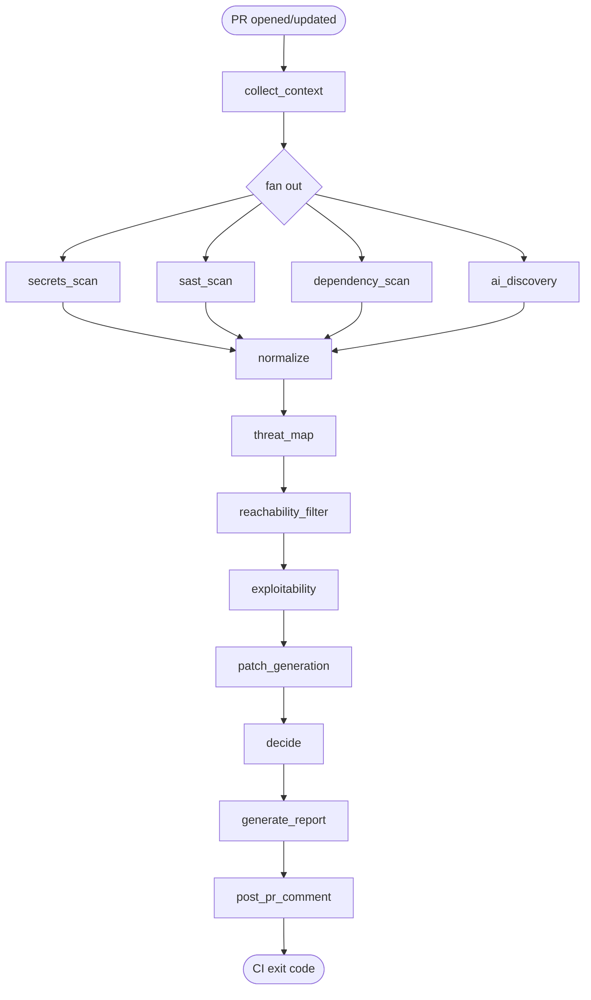

# Design 02 — Orchestrator (LangGraph)

> Detailed spec for `secureflow.orchestrator.*`. Companion to `ARCHITECTURE.md §2.4` and `§3`.

## 1. Why LangGraph

Per user decision 2026-05-14 (`memory/project_decisions_log.md > D1`): adopt LangGraph from Phase 1.

Reasons:
1. The architecture is naturally a DAG with parallel fan-out (4 scanners) and sequential fan-in (normalize → map → exploit → patch → decide → report). LangGraph models that directly.
2. State threading is explicit — every node receives and returns a `SecurityReviewState` `TypedDict`. No global mutable state.
3. Conditional edges (skip AI if not sensitive, skip patches if no findings, short-circuit on budget breach) are first-class.
4. The graph visualizes cleanly — `graph.get_graph().draw_mermaid_png()` produces the architecture diagram for the README.
5. Avoids the "rewrite-the-orchestrator-in-Phase-5" trap from the original plan §16.

## 2. Graph topology



The four scanner nodes run in parallel; LangGraph's reducers merge their list outputs into the state.

## 3. State

Authoritative definition is `secureflow.schemas.SecurityReviewState` (referenced in `ARCHITECTURE.md §3`).

### 3.1 Reducer rules

Because four nodes fan out and write to the state simultaneously, each list-typed field needs a reducer. LangGraph uses `Annotated[list, operator.add]` or a custom reducer.

```python
from typing import Annotated
from operator import add

class SecurityReviewState(TypedDict):
    secret_findings: Annotated[list[dict], add]
    sast_findings: Annotated[list[dict], add]
    dependency_findings: Annotated[list[dict], add]
    ai_discovery_findings: Annotated[list[dict], add]
    scanner_errors: Annotated[dict[str, str], _merge_dict]
    budget_used: Annotated[dict[str, int], _sum_dict]
    # ... single-writer fields use no reducer
```

Single-writer fields (`normalized_findings`, `mapped_findings`, `decision`, etc.) don't need reducers because exactly one node writes them.

### 3.2 What goes on the state vs what stays internal

- On state: data needed by *another* node.
- Not on state: per-node working data (parsed XML, intermediate buffers). Keep nodes lean.

## 4. Node contracts

Every node is a pure function `node(state) -> partial_state_update`. Side effects (subprocess calls, LLM calls, GitHub API calls) are isolated inside the node body — the input/output contract is pure dict.

### 4.1 `collect_context`
- **Reads:** `config`.
- **Writes:** `pr_context` (full `PRContext` as dict).
- **Side effects:** runs `git diff`, optionally reads GitHub PR metadata if `GITHUB_ACTIONS=true`.
- **Failure:** raises `ContextError` → terminal failure of the whole graph (can't proceed without context).

### 4.2 `secrets_scan`
- **Reads:** `pr_context`, `config`.
- **Writes:** `secret_findings: list[dict]`.
- **Side effects:** subprocess `gitleaks detect --no-banner --report-format json`.
- **Failure:** non-terminal. On exception, append to `scanner_errors["gitleaks"]` and write `secret_findings: []`. Pipeline continues.

### 4.3 `sast_scan`
- **Reads:** `pr_context`, `config`.
- **Writes:** `sast_findings: list[dict]`.
- **Side effects:** subprocess `semgrep --config auto --json`. Findings are post-filtered to changed lines ± N context.
- **Failure:** non-terminal (same pattern as 4.2).

### 4.4 `dependency_scan`
- **Reads:** `pr_context`, `config`.
- **Writes:** `dependency_findings: list[dict]`.
- **Side effects:** `syft` for SBOM (if package files exist), `grype` to scan. Optional OSV.
- **Failure:** non-terminal. Special case: if no package manifests exist, return `[]` without running scanners.

### 4.5 `ai_discovery`
- **Reads:** `pr_context`, `config`.
- **Writes:** `ai_discovery_findings`, `prompt_versions["ai_discovery"]`, `budget_used`.
- **Side effects:** Builds code-aware chunks (function + one-hop callers/callees), masks secrets, calls `LLMClient.complete(schema=AIDiscoveryFinding)`.
- **Conditional skip:** skipped if `pr_context.sensitive_files_changed=False` AND `config.ai_discovery.run_on_all_prs=False`. The orchestrator handles the conditional edge — the node itself doesn't decide.
- **Failure modes:**
  - `BudgetExceededError`: orchestrator catches at the edge and routes around the node; report notes "AI discovery skipped: budget".
  - `LLMValidationError` after retry: write `[]` and record in `scanner_errors["ai_discovery"]`.

### 4.6 `normalize`
- **Reads:** all four `*_findings` arrays.
- **Writes:** `normalized_findings: list[dict]` — every finding has stable ID, normalized severity, normalized confidence, source provenance.
- **Side effects:** none.
- **Failure:** pure-Python; failure means a bug. Re-raise.

### 4.7 `threat_map`
- **Reads:** `normalized_findings`.
- **Writes:** `mapped_findings` — each finding gains CWE/OWASP/MITRE/CVE annotations.
- **Logic:** deterministic table first (covers ~90% of common findings); LLM fallback only for `unmapped` findings; preserves scanner-supplied CWEs.

### 4.8 `reachability_filter` *(new node)*
- **Reads:** `mapped_findings`, `pr_context`.
- **Writes:** `reachability_hints: dict[finding_id, "unreachable"|"likely_reachable"|"unknown"]`.
- **Logic:** cheap heuristics — file path under tests/migrations/examples → `unreachable`; symbol referenced from routes/api/handlers → `likely_reachable`; else `unknown`. No LLM call.

### 4.9 `exploitability`
- **Reads:** `mapped_findings`, `reachability_hints`, `pr_context`.
- **Writes:** `exploitability_results: list[dict]`, `budget_used`.
- **Logic:** for each finding (up to `limits.max_findings_to_exploit_check`), call LLM with code context, the finding, and the reachability hint. The hint is in the prompt — the LLM is told "if reachability is `unreachable`, downgrade confidence unless you can show concrete reachability."
- **Critical rule:** the LLM may **never** downgrade a confirmed critical-severity hardcoded secret. The exploitability step is bypassed for `source=gitleaks AND severity=critical` findings (plan §8.8 TODO line 9).
- **Failure:** per-finding errors do not fail the node; that finding is reported with `exploitability=unknown`.

### 4.10 `patch_generation`
- **Reads:** `exploitability_results`, `pr_context`.
- **Writes:** `patch_results: list[dict]`, `final_findings: list[dict]` (merged view with patches attached).
- **Logic:** for each non-`unverified-false-positive` finding, call patch LLM. Then **the verification loop**:
  1. Apply patch to a temp git worktree.
  2. Re-run the originating scanner on the patched file.
  3. If the finding ID no longer appears → `patch_status: verified`.
  4. If finding still appears → `patch_status: unverified`.
  5. If scanner failed/timeout → `patch_status: unverified` with reason.
- **AI-only findings:** can't be re-scanned, so they get `patch_status: not_applicable` from the start.
- **Failure:** patch generation failure for one finding does not block others.

### 4.11 `decide`
- **Reads:** `final_findings`, `config.policy`.
- **Writes:** `decision: dict` (Decision schema), `budget_used`.
- **Logic:** **pure-Python policy engine.** Never an LLM call. Implements the rules in plan §8.10.
- **Failure:** terminal (we can't ship without a decision).

### 4.12 `generate_report`
- **Reads:** everything.
- **Writes:** `markdown_report`, `json_report_path`, `sarif_report_path`.
- **Side effects:** writes files to disk.
- **Failure:** terminal.

### 4.13 `post_pr_comment`
- **Reads:** `markdown_report`, `pr_context`.
- **Writes:** `pr_comment_url`.
- **Side effects:** GitHub API call (only if `GITHUB_TOKEN` set and we're running in Actions mode). Find-or-create the existing SecureFlow comment via a marker like `<!-- secureflow-ai:bot-comment -->`.
- **Failure:** non-terminal in local mode (skip); terminal in Actions mode if comment posting fails.

## 5. Conditional edges

LangGraph's `add_conditional_edges` is used in three places:

1. **After `collect_context`** — route to scanner fan-out always, OR to an early-exit "no relevant changes" node if `pr_context.changed_files == []` (e.g., a docs-only PR). Early-exit emits a `decision = PASS, reason = "no relevant changes"`.
2. **After scanner fan-out** — route to `ai_discovery` conditionally on `pr_context.sensitive_files_changed OR config.ai_discovery.run_on_all_prs`. Otherwise skip directly to `normalize`.
3. **After `exploitability`** — route to `patch_generation` only if `final_findings_excluding_dismissed != []`. Otherwise skip to `decide`.

## 6. Error propagation

Three error classes:

| Class | Behavior |
|---|---|
| **Terminal** (`ContextError`, `DecideError`, `ReportError` in Actions mode) | Whole graph fails; CLI exits 2 (distinct from FAIL=1). |
| **Node-local** (scanner subprocess fail, LLM validation fail) | Caught at node; recorded in `scanner_errors`; pipeline continues. |
| **Budget** (`BudgetExceededError`) | Caught at orchestrator edge; downstream LLM nodes are skipped; recorded in `budget_used`; decision proceeds with scanner-only data. |

The decision agent **knows about errors** — its report includes "Note: AI discovery skipped (budget exceeded)" or "Note: Gitleaks scan errored — secrets not analyzed" so reviewers don't get false confidence.

## 7. Determinism

- Within a single Python process, the graph is deterministic given the same input and cache state.
- Parallel scanner ordering doesn't matter because the reducer is `add` (concat) — for stable output, the normalizer sorts findings by `(file_path, start_line, source)` before assigning IDs.
- LLM temperature is ≤ 0.1 everywhere. Repeat runs hit cache and return identical results.

## 8. Concurrency

- Scanner fan-out uses LangGraph's native parallelism (4 nodes execute concurrently).
- Inside `ai_discovery` and `exploitability`, multiple LLM calls run concurrently up to `limits.max_llm_concurrency` (default 4, with auto-reduction to 2 on free-tier Gemini per §4.4 in `design/01_llm_stack.md`).
- Subprocess scanners (Semgrep etc.) each get up to one CPU core and a timeout (default 120s, overridable per scanner).

## 9. Observability

Per-node structured log line:
```json
{
  "node": "ai_discovery",
  "duration_ms": 1842,
  "tokens_in": 1500,
  "tokens_out": 280,
  "cache_hit": false,
  "findings_emitted": 2,
  "errors": null
}
```

These feed the evaluation harness later. The log destination is `stderr` (so CI captures it) with a `--log-file` CLI flag for local debugging.

## 10. File layout

```
secureflow/orchestrator/
├── __init__.py
├── graph.py            # builds the LangGraph StateGraph
├── state.py            # SecurityReviewState TypedDict + reducers
├── conditions.py       # conditional-edge predicates
├── errors.py           # ContextError, DecideError, BudgetExceededError, etc.
└── visualize.py        # graph.draw_mermaid_png() helper for README
```

## 11. Pseudocode

```python
# secureflow/orchestrator/graph.py
from langgraph.graph import StateGraph, START, END
from .state import SecurityReviewState
from .conditions import has_relevant_changes, should_run_ai, has_findings_to_patch
from secureflow.agents import (
    collect_context, secrets_scan, sast_scan, dependency_scan,
    ai_discovery, normalize, threat_map, reachability_filter,
    exploitability, patch_generation, decide, generate_report,
    post_pr_comment,
)

def build_graph() -> "CompiledStateGraph":
    g = StateGraph(SecurityReviewState)

    g.add_node("collect_context", collect_context)
    g.add_node("secrets_scan", secrets_scan)
    g.add_node("sast_scan", sast_scan)
    g.add_node("dependency_scan", dependency_scan)
    g.add_node("ai_discovery", ai_discovery)
    g.add_node("normalize", normalize)
    g.add_node("threat_map", threat_map)
    g.add_node("reachability_filter", reachability_filter)
    g.add_node("exploitability", exploitability)
    g.add_node("patch_generation", patch_generation)
    g.add_node("decide", decide)
    g.add_node("generate_report", generate_report)
    g.add_node("post_pr_comment", post_pr_comment)

    g.add_edge(START, "collect_context")
    g.add_conditional_edges(
        "collect_context",
        has_relevant_changes,
        {True: ["secrets_scan", "sast_scan", "dependency_scan"], False: "decide"},
    )
    g.add_conditional_edges(
        "collect_context",
        should_run_ai,
        {True: "ai_discovery", False: "normalize"},
    )
    for src in ("secrets_scan", "sast_scan", "dependency_scan", "ai_discovery"):
        g.add_edge(src, "normalize")
    g.add_edge("normalize", "threat_map")
    g.add_edge("threat_map", "reachability_filter")
    g.add_edge("reachability_filter", "exploitability")
    g.add_conditional_edges(
        "exploitability",
        has_findings_to_patch,
        {True: "patch_generation", False: "decide"},
    )
    g.add_edge("patch_generation", "decide")
    g.add_edge("decide", "generate_report")
    g.add_edge("generate_report", "post_pr_comment")
    g.add_edge("post_pr_comment", END)

    return g.compile()
```

## 12. Acceptance criteria

- [ ] `build_graph()` returns a compiled LangGraph state graph.
- [ ] `graph.invoke(initial_state)` runs end-to-end on a fixture repo.
- [ ] Failing one scanner does not fail the graph; failure is recorded in `scanner_errors`.
- [ ] Budget exceeded mid-graph results in a valid decision (scanner-only), not a crash.
- [ ] Docs-only PR (no code changes) shorts to PASS with reason "no relevant changes".
- [ ] `graph.get_graph().draw_mermaid_png()` produces the diagram for README.
- [ ] Same input + same cache state → identical output across two runs.

## 13. Open questions for this subsystem

- **Q-ORCH-1:** Should `ai_discovery` and the scanner fan-out start in parallel, or should `ai_discovery` wait for scanner results so it can use them as additional context? Recommendation: parallel in v1 (simpler, faster); revisit if quality suffers.
- **Q-ORCH-2:** Should `patch_generation` run concurrently across findings, or sequentially? Recommendation: bounded-concurrency (same budget as exploitability) since each patch needs an LLM call and a temp-worktree.
- **Q-ORCH-3:** Where does `temp git worktree` for patch validation live in CI? Recommendation: `mktemp -d` under the runner's workspace; cleanup on graph exit (success or failure) via `try/finally` in the node.
